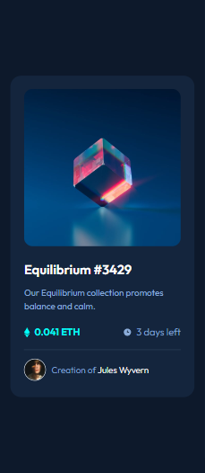

# Frontend Mentor - NFT preview card component solution

This is a solution to the [NFT preview card component challenge on Frontend Mentor](https://www.frontendmentor.io/challenges/nft-preview-card-component-SbdUL_w0U). Frontend Mentor challenges help you improve your coding skills by building realistic projects. 

## Table of contents

- [Overview](#overview)
  - [The challenge](#the-challenge)
  - [Screenshot](#screenshot)
  - [Links](#links)
- [My process](#my-process)
  - [Built with](#built-with)
  - [What I learned](#what-i-learned)
- [Author](#author)


## Overview

### The challenge

Users should be able to:

- View the optimal layout depending on their device's screen g
- See hover states for interactive elements

### Screenshot

 

##### Desktop-view


##### Mobile-view

### Links

- Solution URL: [ NFT-preview-card-component](https://github.com/Ezekiel-Great/nft-preview-card-component)
- Live Site URL: [NFT-preview-card-component Live site URL]( https://ezekiel-great.github.io/nft-preview-card-component-main/)

## My process

### Built with

- Semantic HTML5 markup
- CSS custom properties
- Flexbox


### What I learned

- Hover Effects using pseudo-element


```css
.main .image-equilibrium {
  width: 85%;
  position: relative;
  overflow: hidden;
  cursor: pointer;
}
.image-equilibrium::before {
  display: none;
  content: url("");
  position: absolute;
  inset: 0;
  background: url(./images/icon-view.svg) hsla(178, 100%, 50%, 0.35);
  background-repeat: no-repeat;
  background-position: center;
  border-radius: 16px;
}

.image-equilibrium:hover::before {
  display: block;
}
```


## Author

- Frontend Mentor - [@Ezekiel-Great](https://www.frontendmentor.io/profile/Ezekiel-Great)
- Twitter - [@yeshua_codeit](https://www.twitter.com/yeshua_codeit )

# nft-preview-card-component-main
